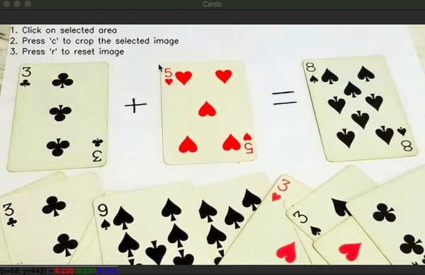

The objective of this python file is to crop the desired box from the give image.

Note: Currently limitation is that it can accept only 4 lines bounded box

#How to run:
Run the below command from the terminal where python this python file is stored.

python crop_image.py --image <imale_file_path>

#Example:
python crop_image.py --image cards.jpg

#Output

